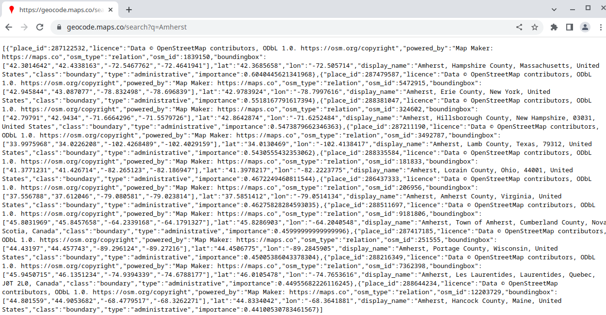
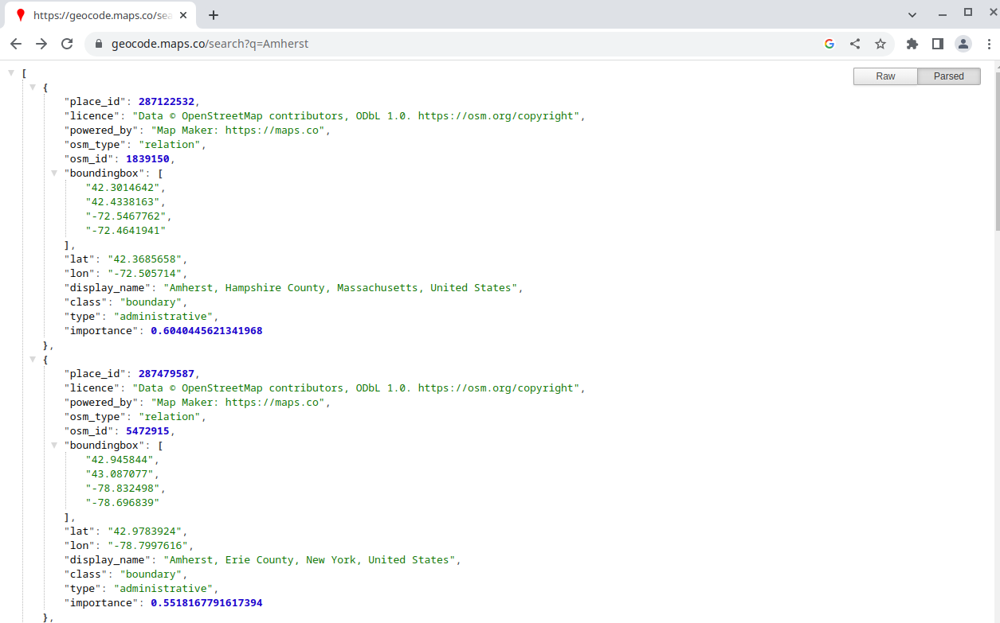

# Homework 6B: Promises and Web Programming

## Notes

- Please download the homework from [here](./hw6-part-b-fall-22.zip)
- This project will be using Node.js and VSCode
  - Reference the [previous homeworks installation instructions](https://github.com/umass-compsci-220/hw6-part-a-fall-22/blob/main/INSTALLATION.md) if need help getting everything installed
- After you download and unzip the project, open the folder one level higher than the `/src` folder in VSCode (File -> Open Folder)
- Run `npm install` inside the terminal (Terminal -> New Terminal)
- Your directory should look something like this:

```txt
hw6-part-b-fall-22/
  node_modules/
  src/
    main.js
  package-lock.json
  package.json
```

## Index

- [Description](#description)
- [Learning Objectives](#learning-objectives)
- [Student Expectations](#student-expectations)
- [Getting Started](#getting-started)
- [Overview](#overview)
- [Programming Tasks](#programming-tasks)
  - [`writeToJSONFile`](#1-writetojsonfile)
  - [`readFromJSONFile`](#2-readfromjsonfile)
  - [`fetchCourseIdsFromSubjectId`](#1-fetchcourseidsfromsubjectid)
  - [`fetchCourseIdsFromSubjectId`](#1-fetchcourseidsfromsubjectid)
  - [`fetchCourseIdsFromSubjectId`](#1-fetchcourseidsfromsubjectid)
  - [`fetchCourseIdsFromSubjectId`](#1-fetchcourseidsfromsubjectid)
- [Testing](#testing)

## Description

## Learning Objectives

## Student Expectations

Students will be graded on:

- Their ability to complete the [programming tasks](#programming-tasks) documented below
- How they design unit-tests for all relevant functions and methods
  - See the [testing section](#testing) for how asynchronous code is tested

## Getting Started

### URLs and Parameters

Source: [MDN - What is a URL?](https://developer.mozilla.org/en-US/docs/Learn/Common_questions/What_is_a_URL)

A Uniform Resource Locater (URL) is an address for a unique resource on the web. It is what your browser uses to retrieve documents, webpages, JavaScript code, images, and other media and supporting files. Each valid URL first tells your browser where the machine processing the request (the web server) lives. The rest of the URL is used by that web server to service the request and give back the corresponding resource.

Here are some examples of URLs:

```text
https://www.google.com/
https://www.google.com/maps
https://www.google.com/search?q=how+to+exit+vim
```

URLs have a specefic structure, which tell both the browser, and the eventual web server, what the request means.


- **The scheme** documents the protocol the network request should use
  - The web uses `https` or `http`
- **The authority** documents where server that will process our request lives
  - The domain maps to a number (called the IP address) that is used to find the web server on the internet
- **The path** describes which resource we want to retrive
  - When the web server first gets the request it will use the path to find the resource we are requesting
- **The parameters** describe how we want to query or provide input for that resource
  - The ask of the URL
  - What specifically is being search for?
  - > `?key1=value1&key2=value2` are extra parameters provided to the Web server. Those parameters are a list of key/value pairs separated with the & symbol. The Web server can use those parameters to do extra stuff before returning the resource. Each Web server has its own rules regarding parameters, and the only reliable way to know if a specific Web server is handling parameters is by asking the Web server owner.
- **The anchor** (irrelevant to this project) will tell the browser where specifically to scroll down to on the page

Looking more closely, at the URLs above:

- `https://www.google.com/` is a URL requesting the resource `/` at `www.google.com`
- `https://www.google.com/maps` is a URL requesting the resource `/maps` at `www.google.com`
- `https://www.google.com/search?q=how+to+exit+vim` is a URL requesting the resource `/search` at `www.google.com` providing a parameter `q` (short for query) with a value `how+to+exit+vim`

If you notice, the value of the `q` parameter looks a little weird. There are some characters that cannot be part of a URL (for examlpe, a space) and some that are reserved for a specific purpose (like `&` separating paramaters). To support passing these characters to parameters, strings first need to be put into a format that can be recognized as a URL. This is called [percent encoding](https://en.wikipedia.org/wiki/Percent-encoding). Luckly, there is a class in the Node.js standard library to handle all of that for you.

During this homework, you will construct URLs with specific parameters using the `URL` class in the Node.js standard library. As an example, if I wanted to make a function that constructs a Google search URL from a given query, I would write:

```js
import { URL } from "node:url"; // Import the URL class from the url library

function makeSearchURL(query) {
  // Construct a new URL object using the resource URL
  const searchURL = new URL("https://www.google.com/search");

  // Access the searchParams field of the constructed url
  // The field holds an instance of the URLSearchParams
  // Add a new "q" parameter with the value of the functions input
  searchURL.searchParams.append("q", query);

  return searchURL.toString(); // Return the resulting complete URL
}

makeSearchURL("vim tutorial youtube");
// -> https://www.google.com/search?q=vim+tutorial+youtube
makeSearchURL("2022 election results");
// -> https://www.google.com/search?q=2022+election+results
makeSearchURL("how to write the & symbol");
// -> https://www.google.com/search?q=how+to+write+the+%26+symbol
makeSearchURL("你好");
// -> https://www.google.com/search?q=%E4%BD%A0%E5%A5%BD
```

More documentation, and examlpes, for the `URL` and `URLSearchParams` class can be found in the [Node.js standard library documentation](https://nodejs.org/dist/latest-v18.x/docs/api/url.html).

### Third-party APIs

Source: [MDN - Instroduction to web APIs](https://developer.mozilla.org/en-US/docs/Learn/JavaScript/Client-side_web_APIs/Introduction)

An Application Programming Interface (**API**) is the interface exposed by an application for other pieces of software to interact with. Web APIs (APIs on the world wide web) are a popular mechanism for exposing information and providing functionality to websites or other programs. A lot of websites are just an interface for interacting with a series of web APIs. These interfaces allow developers to create complex programs without doing all the heavly lifting.

In this homework, you will be interacting with a few third-party web APIs that provide information about universities, longitude and latitude, and weather data. These web APIs have various URL parameters that provide different functionality.

These web APIs will return unformatted JSON results. It is recommended that you either use Firefox or install [this chrome extension](https://chrome.google.com/webstore/detail/json-formatter/bcjindcccaagfpapjjmafapmmgkkhgoa) so the results become readable. As an example:



Could look like this instead:



You will be provided with URLs to various APIs and the parameters they accept. It is your job to research these APIs further, come up with examples, and understand their behavior.

### Fetching Resources

**Fetching** is the process of retrieving the content from a URL across the web. Before your search results are displayed, your browser first needs to fetch the contents of the page located at the URL.

As you might imagine, this process is done asynchronously. Your browser does not wait for a fetch request to return before it allows you to do anything. It will fetch the requested page, allow you to switch tabs or type in other queries, and **then** after the fetch resolves it will display the content.

You will be using the `fetch` function to fetch, then parse, JSON data for the APIs you query.

```js
import fetch from "node-fetch";

fetch("https://geocode.maps.co/search?q=University+of+Massachusetts+Amherst") // fetch the /search resource with a q parameter
  .then((response) => response.json()) // parse the result to a json
  .then(
    (json) =>
      json.length > 0 // This API returns an array of objects
        ? Promise.resolve(json[0]) // Resolve with the first object if present
        : Promise.reject(new Error("No results found.")) // Reject if nothing is present
  )
  .then((data) =>
    console.log(
      `UMass Amherst is located around latitude ${data.lat} and longitude ${data.lon}.`
    )
  )
  .catch((err) => console.log("Unable to retrieve location data: " + err)); // Handle any errors that happened
```

## Overview

### JSDoc

All relevant functions have been documented using [JSDoc](https://jsdoc.app/). JSDoc is a standard for JavaScript comments on classes, methods, functions, and variables. A lot of methods specify input type and variant ("A string that looks like this"). As an example:

```js

```

When implementing these methods, you may assume that the input follows these specifications. For this project, worry less about input, and more about a sound implementation.

### `npm` Commands

- `npm start`: Run the `./src/main.js` file
- `npm test`: Run the `*.test.js` files

## Resources

- [MDN Web Docs: Promise](https://developer.mozilla.org/en-US/docs/Web/JavaScript/Reference/Global_Objects/Promise)
  - Promise syntax, description, examples, and specification
- [MDN Web Docs: Using Promises](https://developer.mozilla.org/en-US/docs/Web/JavaScript/Guide/Using_promises)
  - What are promises, how are they used, what are some common patterns when using them?
- [MDN Web Docs: How to use promises](https://developer.mozilla.org/en-US/docs/Learn/JavaScript/Asynchronous/Promises)
  - Descriptions and examples of promises as they relate to web programming

## Programming Tasks

### 1. `writeToJSONFile`

Write a function, inside of `util.js`, with the following type signature:

```ts
writeToJSONFile(path: string, data: object | object[]): Promise<void>
```

This function should take in a file path (`path`) and some data (`data`), and return a `Promise` that fulfils when the JSON representation of `data` is written to a file located at `path`. Use `writeFile` from the `fs/promises` library.

- [Documentation on `JSON.stringify`](https://developer.mozilla.org/en-US/docs/Web/JavaScript/Reference/Global_Objects/JSON/stringify).
- [Documentation on `writeFile` in the `fs/promises` library](https://nodejs.org/docs/latest-v17.x/api/fs.html#fspromisesreadfilepath-options).

### 2. `readFromJSONFile`

Write a function, inside of `util.js`, with the following type signature:

```ts
readFromJSONFile(path: string): Promise<object | object[]>
```

This function should take in a path to a file (assumed to be JSON data), and return a `Promise` that fulfils with the parsed contents of the file. Use `readFile` from the `fs/promises` library.

- [Documentation on `JSON.parse`](https://developer.mozilla.org/en-US/docs/Web/JavaScript/Reference/Global_Objects/JSON/parse).
- [Documentation on `readFile` in the `fs/promises` library](https://nodejs.org/docs/latest-v17.x/api/fs.html#fspromisesreadfilepath-options).

### 3. `fetchLongitudeAndLatitude`

Write a function, inside of `TODO.js`, with the following type signature:

```ts
fetchLongitudeAndLatitude(query: string): Promise<{ lon: number, lat: number }>
```

This function should take in a query string and return a `Promise` that fulfils to an object. The object should have a field `lon` and a field `lat` - corresponding to the longitude and latitude result of the query. If there are multiple results for a query, pick first one. If there are no results for a location (the result array is empty), then the promise should reject with an error identical to the one below:

```js
new Error("No results found for query.");
```

Use the following API to <https://geocode.maps.co/search?q=QUERY+GOES+HERE> retrieve your results. The base URL should be "https://geocode.maps.co/search" and there should be one URL search parameter "q" where you assign the input to `fetchLongitudeAndLatitude`.

See the [getting started section on queries](#urls-and-queries) if you are confused.

## Testing

Testing asynchronous code is a little different from testing synchronous code. One way or another, the testing framework needs to know that there is pending work to be done. **We tell the testing framework we are still "doing" work by returning a `Promise` in the test function rather than returning nothing**.

As an example, one of the given tests returns a `Promise` that has a handler that does the assertions.

```js
test("fetchLongitudeAndLatitude follows type specification", () => {
  return fetchLongitudeAndLatitude("University of Massachusetts Amherst").then(
    (result) => {
      assert("lon" in result); // Assert the "lon" field is present
      assert("lat" in result); // Assert the "lat" field is present
      assert(Object.keys(result).length === 2); // Assert there are only two keys in the object

      assert(typeof result.lon === "number"); // Assert that the lon value is a number
      assert(typeof result.lat === "number"); // Assert that the lat value is a number
    }
  );
});
```

Your tests should follow this similar pattern (`return foo().then(result => {/* assertions */ })`). Alternatively, you could use `async`/`await` syntax.

```js
test("fetchLongitudeAndLatitude follows type specification", async () => {
  const result = await fetchLongitudeAndLatitude(
    "University  of Massachusetts Amherst"
  );

  assert(typeof result === "object"); // Assert the result is an object
  assert("lon" in result); // Assert the "lon" field is present
  assert("lat" in result); // Assert the "lat" field is present
  assert(Object.keys(result).length === 2); // Assert there are only two keys in the object

  assert(typeof result.lon === "number"); // Assert that the lon value is a number
  assert(typeof result.lat === "number"); // Assert that the lat value is a number
});
```

Use what works best for you and your group members.

## Submitting

If you see this comment, then the autograder has not been published. Please be patient.

- Login to Gradescope
- Open the assignment submission popup
  - Click the assignment
- Open your file explorer and navigate to the folder of the project
  - This is the folder that immediately contains: `node_modules`, `src/`, `package.json`, `package-lock.json`
- Drag and drop the `src/` folder into the submission box
- Click upload

Your submission window should look like the following. **It should not contain any more or any less files.**


